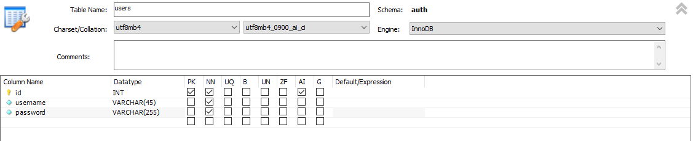
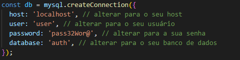

# react-private-routes-jwt

I developed this project in order to study and better understand how the token authentication system works using JWT, and also to better understand private routes, I could understand more about middlewares, and the back-end verification system.

## 🔧 Installation

### MySQL

  1. In your mySQL create a database, example:
  
   

      
    

### Client

  1. `$ cd client`
  2. `$ yarn`
  3. `$ yarn dev`
  
### Server
  1. Change the database connection to the database you created in the `server/index.js` file
    

      
    

  2. `$ cd server`
  3. `$ yarn`
  4. `$ nodemon index.js`

## 🛠️ Technologies

FRONT END
+ `AXIOS`
+ `JWT DECODE`
+ `REACT ROUTER DOM`
+ `REACT TOASTIFY`
+ `REACT ICONS`
+ `STYLED-COMPONENTS`

BACK END
+ `BCRYPT`
+ `EXPRESS`
+ `CORS`
+ `JSONWEBTOKEN`
+ `MYSQL2`
+ `NODEMON`

### 📋 Status Do Projeto

- Finalizado ✔️

  
  

